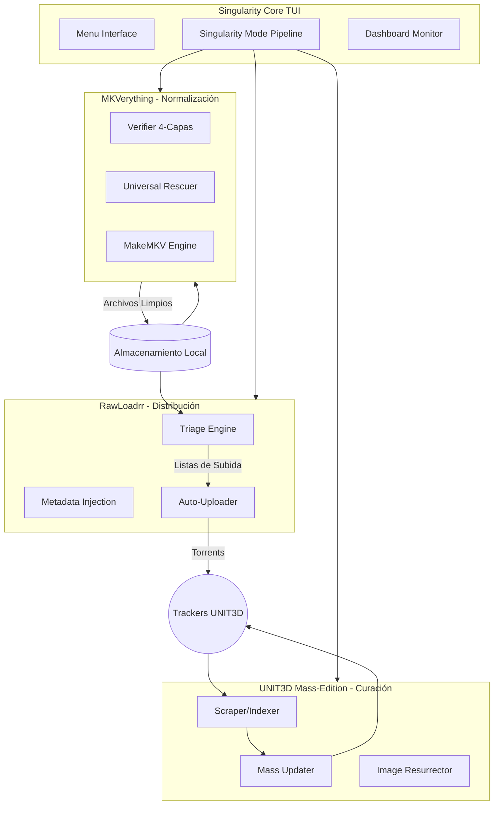

# RaW Suite: Singularity Core

> **"Transforming chaos into order. One bit at a time."**


Bienvenido a **Singularity Core**, la suite definitiva de orquestación y automatización para la gestión de medios P2P. Diseñada originalmente para la comunidad española (EMUWAREZ/MILNU), esta herramienta ha evolucionado hasta convertirse en un ecosistema completo para la normalización, auditoría y distribución masiva de contenido.

## 🎯 ¿Para qué sirve?

Singularity resuelve el problema de las bibliotecas de medios fragmentadas, corruptas o en formatos obsoletos. Proporciona un pipeline unificado que:
1.  **Sanea** tu biblioteca (ISO -> MKV, Legacy -> MKV).
2.  **Verifica** la integridad forense de cada archivo.
3.  **Clasifica** el contenido por calidad y codec.
4.  **Distribuye** automáticamente a trackers privados (UNIT3D).

## 🛠️ ¿Cómo usarlo?

La suite está diseñada para ejecutarse principalmente a través de su interfaz TUI (Terminal User Interface).

1.  **Docker (Recomendado):**
```bash
make install
make up
make attach
singularity
```
2.  **Manual:**
    ```bash
    python3 singularity.py
    ```

Desde el menú principal, puedes acceder a los módulos individuales o lanzar el **SINGULARITY MODE (Opción 5)** para una automatización total.

## 🏗️ Arquitectura y Funcionamiento

El sistema se basa en un diseño modular donde cada componente cumple una función específica dentro del ciclo de vida del contenido:



| Módulo | Acción | Objetivo |
| :--- | :--- | :--- |
| **MKVerything** | Normalización | Convierte todo a MKV limpio y verificado. |
| **RawLoadrr** | Inyección | Sube el contenido a trackers con metadatos perfectos. |
| **UNIT3D Orch** | Mantenimiento | Gestiona y actualiza torrents ya existentes en masa. |
| **Singularity Core** | Orquestación | El "Cerebro" que conecta todas las fases. |

### Medidas de Seguridad y Resiliencia

Singularity ha sido construido bajo una filosofía de **cero pérdida de datos** y **resiliencia operativa**:

*   **Verificación en 4 Capas:** Antes de dar un archivo por "bueno" o eliminar un original, se comprueba su estructura (mkvmerge), sus metadatos (ffprobe), su capacidad de decodificación completa (ffmpeg null-scan) y se compara con el original.
*   **Persistencia de Estado:** Todos los módulos utilizan archivos de estado (`states/`) para saber qué archivos se han procesado. Si el sistema se apaga, **resume** exactamente donde se quedó.
*   **Aislamiento Docker:** Todo el entorno (incluyendo dependencias complejas como `makemkvcon` y `vapoursynth`) está encapsulado, evitando conflictos con el sistema host.
*   **Logs Forenses:** Cada decisión tomada por el sistema queda registrada en `logs/`, permitiendo auditorías posteriores si algo no sale como se esperaba.

---

## 🧭 Guía de Navegación

*   [**Configuración Inicial**](setup.md): Prepara tu entorno y secretos.
*   [**MKVerything**](mkverything.md): Detalles sobre la normalización y rescate.
*   [**RawLoadrr**](rawloadrr.md): Automatización de subidas y trackers.
*   [**UNIT3D Orchestrator**](unit3d_orchestrator.md): Gestión masiva en el tracker.
*   [**Singularity Mode**](singularity_mode.md): Documentación detallada del pipeline automático.
*   [**Dashboard Web**](dashboard.md): Monitorización en tiempo real desde el navegador.
*   [**Notas Técnicas**](technical_notes.md): Saber acumulado y arquitectura profunda.
