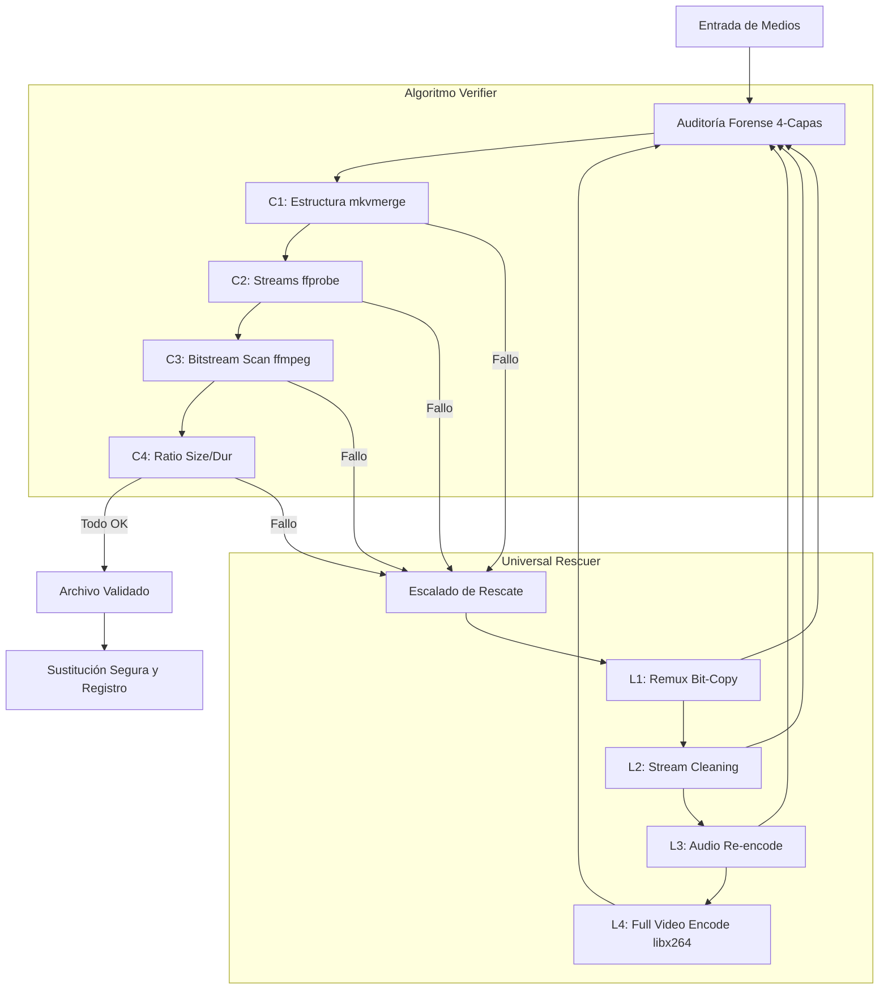

# MKVerything — El Cirujano de Medios

> **"Estandarización absoluta. Integridad innegociable."**

**MKVerything** es el motor de saneamiento de Singularity Core. Su objetivo es convertir cualquier biblioteca de medios heterogénea en una colección de archivos MKV limpios, verificados y listos para su distribución.

## 🎯 ¿Para qué sirve?

*   **Extrae** el contenido principal de imágenes ISO (DVD/Blu-ray) automáticamente.
*   **Moderniza** formatos obsoletos (`.avi`, `.mp4`, `.wmv`) a MKV moderno.
*   **Rescata** archivos MKV corruptos mediante remuxado o re-encodado.
*   **Limpia** metadatos de spam (anuncios de grupos, links, etc.).

## 🛠️ ¿Cómo usarlo?

1.  **Desde el menú Singularity:** Pulsa `1` para entrar en el submenú de MKVerything.
2.  **Modos disponibles:**
    *   **Launcher [1.1]:** Acceso al menú interactivo completo.
    *   **Setup [1.2]:** Verificación rápida de dependencias.
    *   **Test [1.3]:** Comprobación de binarios instalados.

Para procesar una biblioteca completa de forma desatendida, selecciona la **Opción [5] (God Mode)** dentro del Launcher.

## ⚙️ Funcionamiento Interno (The Guts)

El núcleo de MKVerything es su **algoritmo de verificación en 4 capas** y su **motor de rescate recursivo**:



1.  **Capa 1 (Estructura):** Usa `mkvmerge` para validar que el contenedor es íntegro. Si falla, intenta un remux directo.
2.  **Capa 2 (Metadatos):** Usa `ffprobe` para verificar que los streams de audio/video/subs son legibles.
3.  **Capa 3 (Decodificación):** Realiza un escaneo nulo con `ffmpeg` (`-f null -`). Si hay errores de bitstream, el archivo se marca para rescate.
4.  **Capa 4 (Comparación):** Tras procesar, compara el tamaño y duración con el original para evitar "falsos positivos".

### Escalamiento de Rescate

Si un archivo falla las pruebas de integridad, MKVerything escala automáticamente:
*   **Nivel 1:** Intento de remux simple (bit-copy).
*   **Nivel 2:** Limpieza de streams (elimina pistas corruptas, subtítulos rotos).
*   **Nivel 3:** Re-encodado de audio (si el video es apto pero el audio falla).
*   **Nivel 4:** Re-encodado completo (libx264/AAC como último recurso).

## 🔧 Configuración y Ajustes

### Personalización de SPAM

Puedes ajustar qué términos se consideran spam editando `singularity_config.py`:
```python
SPAM_KEYWORDS = [
    "rarbg", "yify", "ettv", "www.", ".com", "torrent", ...
]
```
MKVerything eliminará estos términos de los títulos de las pistas y comentarios globales durante el procesado.

### Resiliencia y Seguridad

*   **Sacralidad de ISOs:** El sistema **nunca elimina** una imagen ISO. Solo extrae su contenido.
*   **Eliminación Segura:** Los archivos originales (`.avi`, `.mp4`) solo se borran tras pasar con éxito la Capa 4 de verificación del nuevo MKV.
*   **Estado Persistente:** Los progresos se guardan en `MKVerything/states/`. Si detienes el proceso, al reiniciarlo saltará los archivos ya procesados con éxito.
