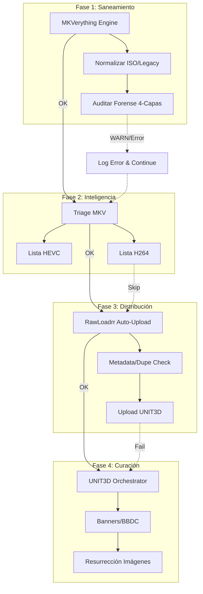
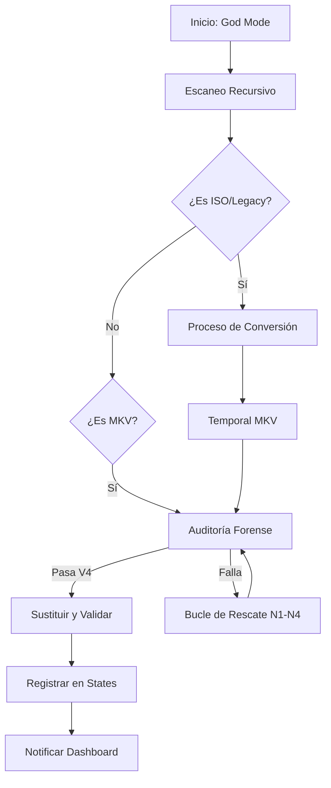

# Singularity Mode — El Pipeline Maestro

> **"Un solo comando para gobernarlos a todos."**

**Singularity Mode (Opción 5)** es la culminación de la suite. Es un orquestador desatendido que ejecuta secuencialmente las cuatro fases críticas del ciclo de vida del contenido.

## 🎯 ¿Para qué sirve?

Permite al operador configurar un flujo completo de trabajo —desde la extracción de una ISO hasta su publicación final en el tracker— y dejar que el sistema lo ejecute de forma autónoma. Es ideal para procesar grandes volúmenes de medios con una intervención inicial mínima.

## 🛠️ ¿Cómo usarlo?

1.  **Lanza Singularity Core:** `python3 singularity.py` o `make attach`.
2.  **Selecciona la Opción [5].**
3.  **Configuración Inicial (TUI):** El sistema te pedirá:
    *   Directorio raíz de medios y destino de ISOs.
    *   Tracker de destino para la subida.
    *   Rango de IDs para el orquestador UNIT3D.
    *   Credenciales faltantes (si las hay, se guardarán en el `.env`).
4.  **Ejecución:** El pipeline se iniciará automáticamente.

## 🏗️ Las 4 Fases del Pipeline

El Singularity Mode orquesta los módulos en el siguiente orden lógico, con **puntos de recuperación** en cada transición:

### Fase 1: MKVerything God Mode
*   **Acción:** Escaneo masivo de la raíz de medios.
*   **Procesado:** Extracción de ISOs -> Conversión Legacy -> Rescate de archivos corruptos.

*   **Resiliencia:** Si una extracción falla, el sistema lo loguea y continúa con la siguiente.

### Fase 2: Triage MKV
*   **Acción:** Análisis de codecs de la biblioteca saneada en la Fase 1.
*   **Objetivo:** Generar listas actualizadas (`todo-hevc-*.txt`) para la subida.
*   **Personalización:** El usuario puede elegir usar la lista HEVC, la H264, una personalizada o todo el directorio.

### Fase 3: RawLoadrr Auto-Upload
*   **Acción:** Inyección masiva al tracker.
*   **Procesado:** Toma la lista de la Fase 2 y sube cada carpeta secuencialmente.
*   **Seguridad:** Verifica duplicados en el tracker antes de cada subida para proteger el ratio del usuario.

### Fase 4: UNIT3D Orchestrator (Opcional)
*   **Acción:** Mantenimiento masivo del tracker.
*   **Procesado:** Ejecuta la secuencia de scripts 01-04 (Scraper, Indexer, Updater, Resurrector) para el rango de IDs configurado.
*   **Objetivo:** Asegurar que los torrents recién subidos (y los antiguos) tengan metadatos e imágenes perfectos.

## ⚙️ Funcionamiento y Resiliencia

### Manejo de Errores
Cada fase está encapsulada en un bloque `try/except`. Si una fase falla críticamente:
1.  Se registra el error detallado en el log de Singularity.
2.  El sistema presenta una advertencia visual.
3.  **El pipeline continúa** con la siguiente fase si es posible, garantizando que un error puntual no detenga toda la operación nocturna.

### Resumen Final
Al finalizar el pipeline, Singularity genera una **Tabla de Resumen Forense** que muestra:
*   Estado de cada fase (OK, WARN, ERROR, SKIP).
*   Tiempo transcurrido por fase.
*   Estadísticas clave (ISOs extraídas, GBs ahorrados, torrents subidos).

## 🔧 Configuración y Ajustes

El Singularity Mode ajusta dinámicamente el `PATH` y el `PYTHONPATH` para importar los módulos de `MKVerything` y `RawLoadrr` directamente, lo que garantiza una integración profunda y una velocidad de ejecución superior a las llamadas por subproceso.
