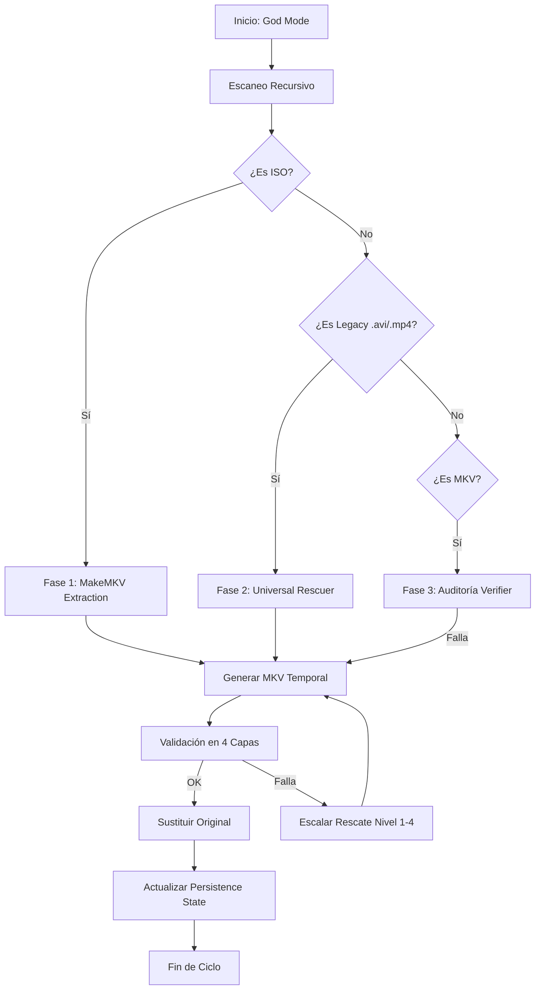
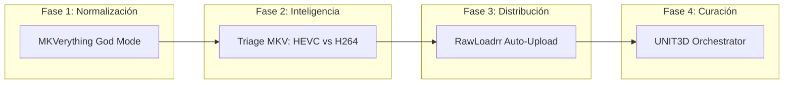

# Notas Técnicas: El Corazón de la Bestia

Este documento consolida el conocimiento técnico acumulado durante el desarrollo de **Singularity Core**. Es la guía definitiva para administradores y desarrolladores que deseen entender las entrañas del sistema, su resiliencia y su lógica de automatización.

## 🧬 Filosofía de Diseño: "Zero Loss & Maximum Resiliencia"

Singularity no es solo un script; es un orquestador que asume que el entorno es hostil (archivos corruptos, desconexiones, falta de espacio). Por ello, se apoya en tres pilares:
1.  **Validación Forense:** No confiamos en la extensión del archivo ni en su tamaño. Usamos un escaneo nulo de decodificación completa para asegurar que el archivo es "jugable" antes de procesarlo.
2.  **Idempotencia (Resume):** Cada módulo guarda su estado. Si el proceso se interrumpe al 99%, al reiniciar solo procesará el 1% restante.
3.  **Aislamiento:** El uso de Docker garantiza que las versiones de `ffmpeg`, `makemkvcon` y `vapoursynth` sean exactamente las que el código espera, evitando el "it works on my machine".

---

## ⚡ Workflow: God Mode (MKVerything)

El **God Mode** es el pipeline de limpieza local. Su objetivo es convertir el "ruido" de un disco duro en una biblioteca MKV estandarizada.

### El Algoritmo de 4 Capas (Verifier)
*   **Capa 1:** `mkvmerge` (Estructura del contenedor).
*   **Capa 2:** `ffprobe` (Integridad de streams).
*   **Capa 3:** `ffmpeg -f null` (Bitstream scan completo).
*   **Capa 4:** `Comparación de Metadatos` (Size/Duration ratio).

---

## ⚡ Workflow: Singularity Mode (The Core Pipeline)

El **Singularity Mode** es el pipeline de nivel superior que conecta el almacenamiento local con el mundo exterior (Trackers).

### Resiliencia en el Pipeline
*   **Try/Except Orchestration:** Si la Fase 4 falla (ej: el tracker está caído), el Singularity Mode no detiene las fases anteriores ni corrompe el estado. Simplemente reporta `WARN` en el Dashboard y finaliza de forma segura.
*   **Detección de Duplicados:** Antes de subir nada en la Fase 3, el sistema consulta la API del tracker. Esto evita el "Shadow Ban" o el borrado de torrents por duplicidad.

---

## 🔐 Seguridad y Anonimato (TOR Integration)

Para los administradores que operan en entornos sensibles, Singularity integra **TOR** como un túnel de primer nivel.
*   **Túnel SOCKS5:** `RawLoadrr` detecta si TOR está activo y enruta las peticiones de API y Announce a través de `127.0.0.1:9050`.
*   **User-Agent Switching:** El sistema imita navegadores reales para evitar el fingerprinting de scripts automáticos.

## 📊 Dashboard y Monitorización
El Dashboard (puerto 8002) utiliza un sistema de **Single Source of Truth** leyendo [./logs/current_status.json](./logs/current_status.json). Este archivo es actualizado de forma asíncrona por los hilos de ejecución de cada módulo, permitiendo una monitorización sin latencia y con bajo impacto en CPU.

---

## 🛠️ Stack Tecnológico Detallado

| Componente | Tecnología |
| :--- | :--- |
| **Lenguaje** | Python 3.11+ (Entorno Dockerizado) |
| **Framework Web** | FastAPI + Jinja2 (Dashboard) |
| **Interfaz TUI** | `rich` + `argparse` + `Prompt` |
| **Análisis Multimedia** | `pymediainfo`, `ffmpeg-python`, `makemkvcon`, `mkvmerge` |
| **Base de Datos APIs** | TMDB, IMDB (Cinemagoer), MusicBrainz, Discogs |
| **Red y Anonimato** | TOR (SOCKS5 fallback), `requests`, `aiohttp` |
| **Gestión de Torrent** | `torf`, `bencodepy`, APIs de qBittorrent/Deluge/Transmission |
| **Persistencia** | File-based JSON (`states/`) & `.env` secrets |

---

## 🔄 Inter-Project Relationship (The Pipeline)

Singularity no es un monolito, sino un **Orquestador de Orquestadores**. La relación entre sus partes es simbiótica:

1.  **MKVerything** (Normalización): Toma el "ruido" (ISOs, AVIs, archivos rotos) y lo convierte en MKV verificado.
2.  **Triage MKV** (Inteligencia): Analiza la biblioteca limpia y decide qué es HEVC (listo para subir) y qué es H264 (prioridad secundaria o rescate).
3.  **RawLoadrr** (Distribución): Toma las listas de Triage y las inyecta en los trackers UNIT3D con metadatos perfectos.
4.  **UNIT3D Orchestrator** (Curación): Realiza el mantenimiento de los torrents ya existentes (cambio de imágenes, actualización de descripciones, re-indexado).

